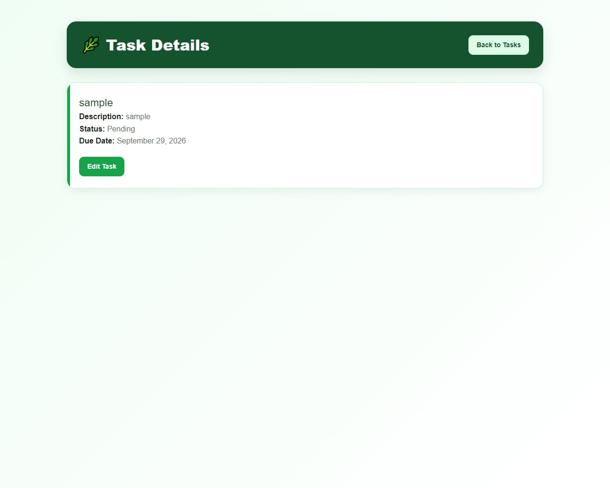
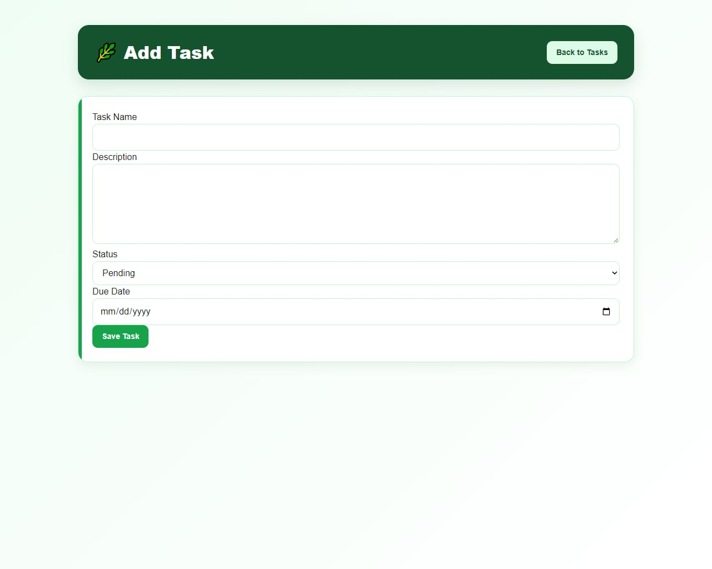
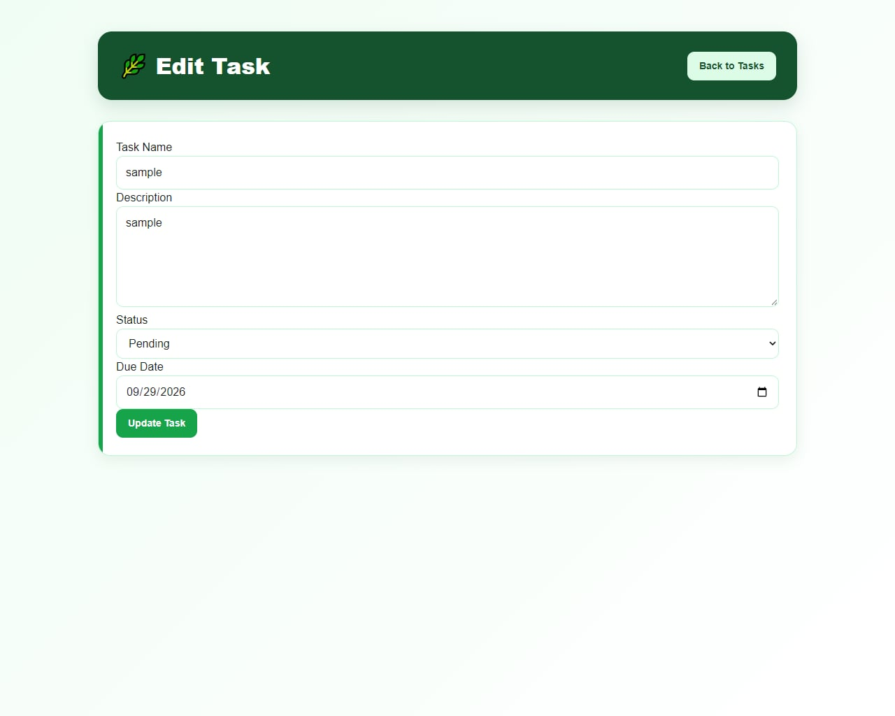
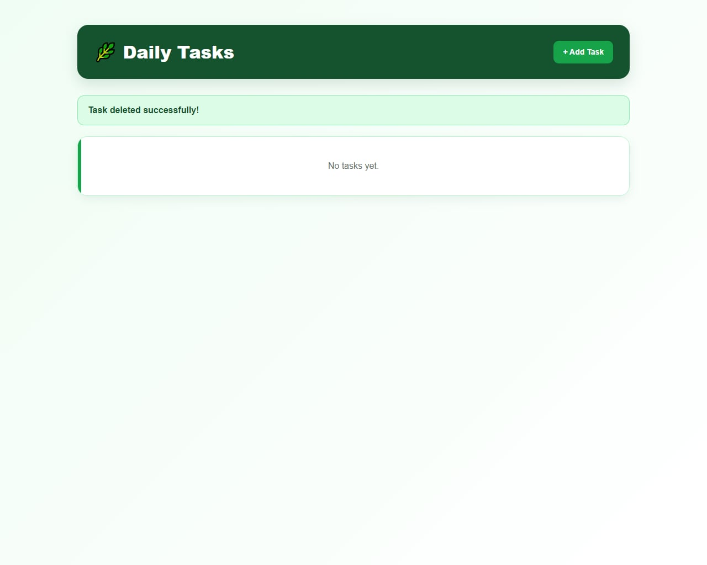

# Daily Task Manager

A simple Laravel web application for managing daily tasks and keeping track of their progress.

## Project Code

WST21-PM-2026-SF

## Student Name

Jetro Meniao

## Course & Year

BSIT 2nd Year

## Database Used

SQLite

## Features

- Add Task
- View Tasks
- Edit Tasks
- Delete Tasks
- Set Due Date
- Update Task Status

## How It Works

### 1. View Tasks

The main page shows all saved tasks along with their description, current status, and due date.

### 2. Add a Task

Select **Add Task** and provide the task name, description, status, and due date. Save the form to add the new task.

### 3. Edit a Task

Choose **Edit** beside a task to modify its details, such as the task name, description, status, or due date.

### 4. Update Task Status

The task status can be changed between **Pending** and **Completed** when editing a task.

### 5. Delete a Task

Select **Delete** to remove a task that is no longer needed.